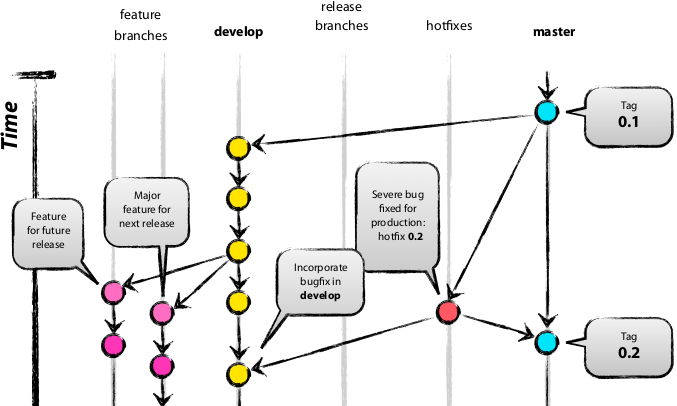
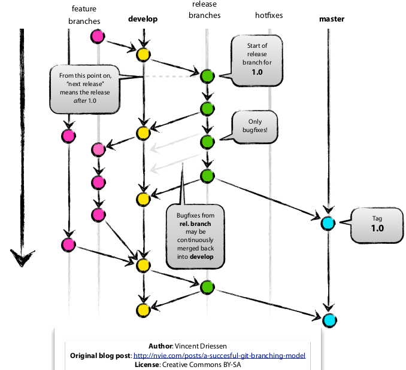

## Version control

Note:
links on top
* https://guides.github.com/introduction/git-handbook/
* https://en.wikipedia.org/wiki/Version_control
* https://en.wikipedia.org/wiki/Git
* https://betterexplained.com/articles/a-visual-guide-to-version-control/
* https://betterexplained.com/articles/intro-to-distributed-version-control-illustrated/
* https://github.com/Krten
* http://opensuse.github.io/branding-guidelines/
* https://github.com/hakimel/reveal.js
* https://de.wikipedia.org/wiki/Versionsverwaltung
* https://guides.github.com/features/mastering-markdown/
* https://github.com/arslanbilal/git-cheat-sheet
* https://github.com/detailyang/awesome-cheatsheet
* https://guides.github.com/pdfs/markdown-cheatsheet-online.pdf
* https://betterexplained.com/articles/aha-moments-when-learning-git/
* http://nvie.com/posts/a-successful-git-branching-model/

--

### Why?
* The problem: How to save a file in different versions?

 

--

### Root cause
* The existence of the *Save As*-Button or version control can be summed up to a simple root cause: 
  * **You want to work in a new file without destroying the source data** (e.g. a document, source code, a picture or whatever)
* **However** that does not mean, that this is easy to solve ;)

--

### A bit of boring theory ;)
* **Version control** in general describes any **system** to **track changes** in **documents** or **files**
* The **changes** are usually identified by a *number* called **revision number** or just **revision**
  * **Revisions** are **saved** in an **archive** with at least the attributes: **timestamp** and **author**
  * **Revisions** can be **compared**, **restored** and *depending on filetype* **merged**

--

### Easy example 1/2
* **Testdocument.txt** has the following attributes:
  * **Revision**: 0
    * **Author**: Bob
    * **Timestamp**: 2018-01-23T17:04:30+01:00
* **Testdocument.txt** has the following attributes:
  * **Revision**: 1
    * **Author**: Alice
    * **Timestamp**: 2018-01-23T18:04:30+01:00

--

### Easy example 2/2

**Contents of Testdocument.txt**

|Revision 0   | Revision 1   |
|------------ | -------------|
|Hello!       | Hello World! |

---

## Version control systems (VCS)
### sorry - still some theory ;)

--

### Main tasks 1/2

* **Logging / Tracking** of changes
  * It is possible to find out which **change** was done and by **whom** and **when** at **any time**
* **Restoring** of old **revisions** of **any file**
* **Archiving** of every **state** of a project
  * It is possible to access all **versions** of a project at **any time**

--

### Main tasks 2/2
* **Enabling collaboration** in teams
  * **Coordinating** multiple access on files by different developers
  * **Synchronization** of files between different developers
  * **Short- and Long-term undo** if a file was messed up or will be messed up at some point
  * **Simultanous development** in **different branches**
  * **Merging** from *development* branches to *productive* branches

--

### Common vocabulary 1/2

* Clone
* Branch
* Checkout
* Change
* Commit
* Conflict / Merge conflict
* Resolve
* Forward integration / Reverse integration

Note:
Clone = Cloning means creating a repository containing the revisions from another repository. This is equivalent to pushing or pulling into an empty (newly initialized) repository. As a noun, two repositories can be said to be clones if they are kept synchronized, and contain the same revisions.

Branch = a set of files under version control may be branched or forked at a point in time so that, from that time forward, two copies of those files may develop at different speeds or in different ways independently of each other

Checkout = To check out (or co) is to create a local working copy from the repository. A user may specify a specific revision or obtain the latest. The term checkout can also be used as a noun to describe the working copy.

Change = A change (or diff, or delta) represents a specific modification to a document under version control. The granularity of the modification considered a change varies between version control systems.

Commit = To commit (check in, ci or, more rarely, install, submit or record) is to write or merge the changes made in the working copy back to the repository. The terms commit and checkin can also be used as nouns to describe the new revision that is created as a result of committing.

Conflict = A conflict occurs when different parties make changes to the same document, and the system is unable to reconcile the changes. A user must resolve the conflict by combining the changes, or by selecting one change in favour of the other.

Resolve = The act of user intervention to address a conflict between different changes to the same document.

Forward integration = The process of merging changes made in the main trunk into a development (feature or team) branch.

Reverse integration = The process of merging different team branches into the main trunk of the versioning system.

--

### Common vocabulary 2/2
* Merge
* Pull, Push
* Repository
* Tag
* Trunk
* Working copy
* Head

Note:
Merge = A merge or integration is an operation in which two sets of changes are applied to a file or set of files. Some sample scenarios are as follows:
 A user, working on a set of files, updates or syncs their working copy with changes made, and checked into the repository, by other users.
 A user tries to check in files that have been updated by others since the files were checked out, and the revision control software automatically merges the files (typically, after prompting the user if it should proceed with the automatic merge, and in some cases only doing so if the merge can be clearly and reasonably resolved).
 A branch is created, the code in the files is independently edited, and the updated branch is later incorporated into a single, unified trunk
 A set of files is branched, a problem that existed before the branching is fixed in one branch, and the fix is then merged into the other branch. (This type of selective merge is sometimes known as a cherry pick to distinguish it from the complete merge in the previous case.)

Pull / Push = Copy revisions from one repository into another. Pull is initiated by the receiving repository, while push is initiated by the source. Fetch is sometimes used as a synonym for pull, or to mean a pull followed by an update.

Repository = The repository is where files current and historical data are stored, often on a server.

Tag = A tag or label refers to an important snapshot in time, consistent across many files. These files at that point may all be tagged with a user-friendly, meaningful name or revision number. See baselines, labels and tags.

Trunk = The unique line of development that is not a branch (sometimes also called Baseline, Mainline or Master)

Working copy = The working copy is the local copy of files from a repository, at a specific time or revision. All work done to the files in a repository is initially done on a working copy, hence the name. Conceptually, it is a sandbox.

Head = Also sometimes called tip, this refers to the most recent commit, either to the trunk or to a branch. The trunk and each branch have their own head, though HEAD is sometimes loosely used to refer to the trunk.

--

### Visualization 1/2

 

--

### Visualization 2/2

---

### Sources & Copyright
Sources:

