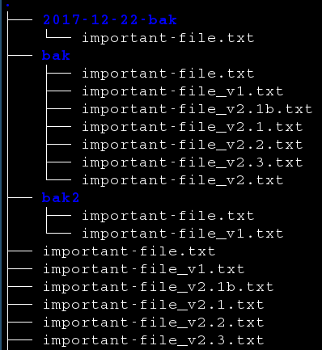

## Version control

Note:
links on top
* https://guides.github.com/introduction/git-handbook/
* https://en.wikipedia.org/wiki/Version_control
* https://en.wikipedia.org/wiki/Git
* https://betterexplained.com/articles/a-visual-guide-to-version-control/
* https://betterexplained.com/articles/intro-to-distributed-version-control-illustrated/
* https://github.com/Krten
* http://opensuse.github.io/branding-guidelines/
* https://github.com/hakimel/reveal.js
* https://de.wikipedia.org/wiki/Versionsverwaltung
* https://guides.github.com/features/mastering-markdown/
* https://github.com/arslanbilal/git-cheat-sheet
* https://github.com/detailyang/awesome-cheatsheet
* https://guides.github.com/pdfs/markdown-cheatsheet-online.pdf

--

### why?
* the problem: How to save a file in different versions?

 

--

### a bit of boring theory ;)

---

## Version control systems (VCS)

--

### main features

* **tracks** the **history of changes** (versions) of arbitrary files
* *designed* for **collaboration** in teams
* **any version** can be *recovered* at **any time**

---

### Sources & Copyright
Sources:

